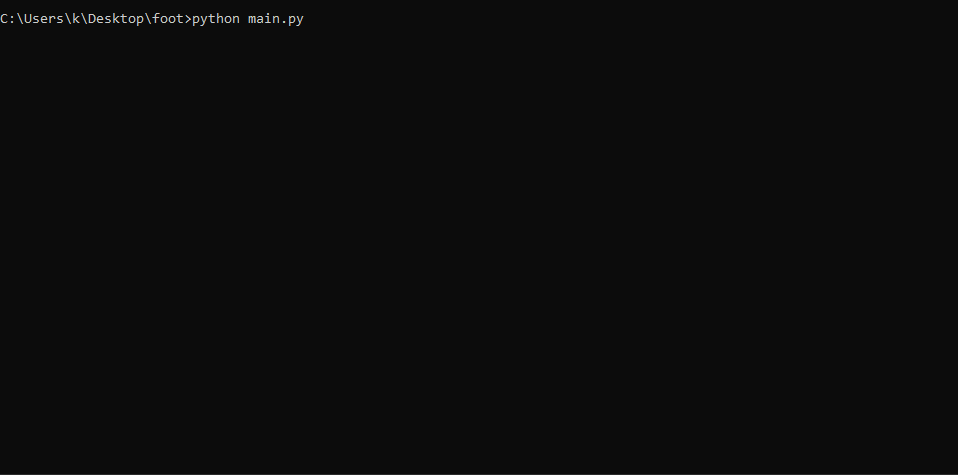

# Utilisation de BeautifulSoup Python

Beautiful Soup est un paquet Python pour l'analyse des documents HTML et XML. Il crée un arbre d'analyse pour les pages analysées qui peut être utilisé pour extraire des données du HTML, ce qui est utile pour le web scraping.

Dans un cadre d'apprentissage, j'ai réussi à récupérer facilement des données du site : https://www.matchendirect.fr/live-score/

## Demonstration

